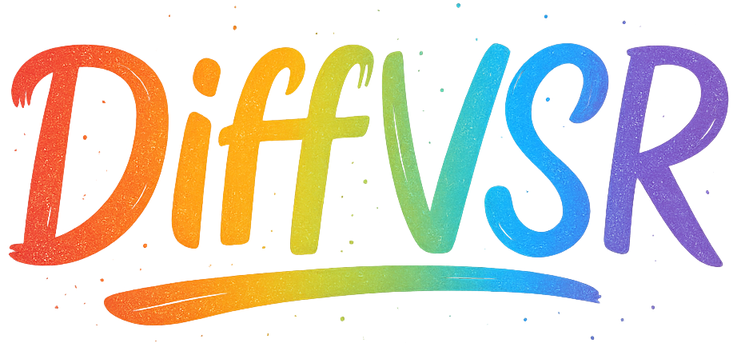
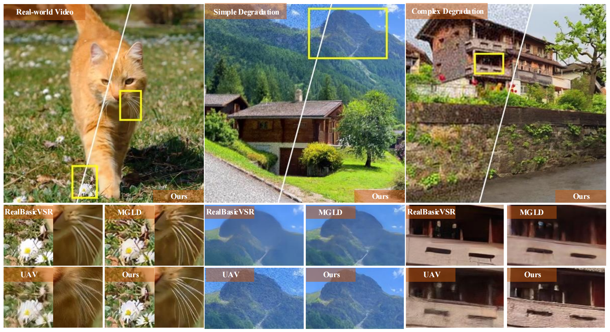
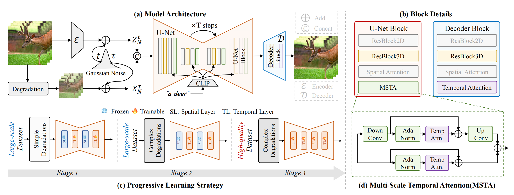
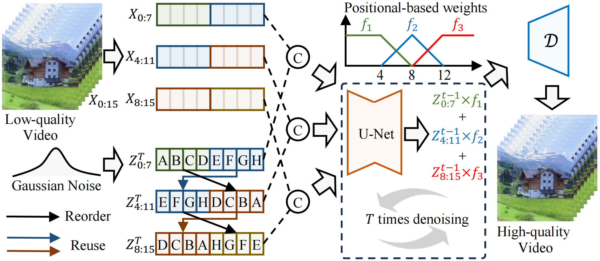

<div align="center">

<p>
  
</p>
<h1>
  Revealing an Effective Recipe for Taming Robust<br>
  Video Super-Resolution Against Complex Degradations
</h1>

<div>
  <strong>ICCV 2025</strong>
</div>

<h4 align="center">
  <!-- Fill these links with your own resources -->
  <a href="https://xh9998.github.io/DiffVSR-project/" target="_blank">
    
  </a>
  <a href="https://arxiv.org/abs/2501.10110" target="_blank">
    
  </a>
  <a href="https://www.youtube.com/embed/ezRM2xF3fDw" target="_blank">
    
  </a>
  <a href="https://huggingface.co/huihui9998/DiffVSR/tree/main" target="_blank">
    
  </a>
</h4>

<strong>DiffVSR unlocks the power of diffusion models to tackle severe degradation by shifting the focus from complex architectures to a more effective learning strategy.</strong>

<div style="width: 100%; text-align: center; margin:auto;">
  
</div>

:open_book: For more visual results, visit the <a href="https://xh9998.github.io/DiffVSR-project/" target="_blank">project page</a>.

</div>

---

## 🔥 Update
- [2025.10] Inference code is released.
- [2025.01] This repo is created.


## 🎬 Overview



<!-- ## 🧩 ILT Illustration
<p align="center">
  
</p> -->


## 🔧 Dependencies and Installation
Clone and set up the environment:
```bash
git clone https://github.com/xh9998/DiffVSR.git
cd DiffVSR
```

We provide a conda environment file. Create and activate it:
```bash
conda env create -f DiffVSR_env.yml
conda activate DiffVSR
```
Key packages (see `DiffVSR_env.yml` for the full list): PyTorch 2.0.0 (CUDA 11.7), diffusers 0.30.0, torchvision 0.15.0, einops, opencv, pandas, rotary-embedding-torch, xformers (optional), imageio.

## 📂 Pretrained Models
Please download the following three items from Hugging Face and place them under `./pretrained_models/`:
- `TE-3DVAE.pt`
- `DiffVSR_UNet.pt`
- `upscaler4x/` folder

Download: [DiffVSR](https://huggingface.co/huihui9998/DiffVSR/tree/main) on Hugging Face

Directory example:
```
DiffVSR/
 └─ pretrained_models/
     ├─ TE-3DVAE.pt
     ├─ DiffVSR_UNet.pt
     └─ upscaler4x/
```

## ☕️ Quick Inference
`--input_path` can be a single video, a frames folder, or a folder of videos.

```bash
python inference_tile.py \
  -i ./test_video/video1 \
  -o ./output \
  -txt /path/to/captions.csv
```

Arguments (main):
- `-i/--input_path`: video file, frames folder, or folder of videos
- `-o/--output_path`: directory for output mp4
- `-txt/--val_prompt`: CSV containing `video_name` and `caption`
- `-p/--pretrained_model`: UNet checkpoint path
- `-n/--noise_level`: noise level (default 50)
- `-g/--guidance_scale`: guidance scale (default 5)
- `-s/--inference_steps`: denoising steps (default 50)
- `-oimg/--outputimage_path`: dump generated PNG frames when provided
- `--use_ffmpeg`: use ffmpeg for video encoding (typically smaller files than imageio.mimwrite, with slightly lower visual sharpness)

## 🧩 CSV Prompt Format
`--val_prompt` CSV should include one row per video with columns:
- `video_name`: base name matching input video
- `caption`: positive prompt text

The script concatenates an internal positive prompt string.


## ❤️ Acknowledgement
Our work builds upon the foundations laid by many excellent projects in the field. We would like to thank the authors of [LaVie/vsr](https://github.com/Vchitect/LaVie/tree/main/vsr). We also drew inspiration for our inference strategy from [Upscale-A-Video](https://github.com/sczhou/Upscale-A-Video). We are grateful for their contributions to the community.


## 📑 Citation
If you find this repo useful, please consider citing (fill your bibtex):
```bibtex
@article{li2025diffvsr,
  title={DiffVSR: Revealing an Effective Recipe for Taming Robust Video Super-Resolution Against Complex Degradations},
  author={Li, Xiaohui and Liu, Yihao and Cao, Shuo and Chen, Ziyan and Zhuang, Shaobin and Chen, Xiangyu and He, Yinan and Wang, Yi and Qiao, Yu},
  journal={arXiv preprint arXiv:2501.10110},
  year={2025}
}
```


